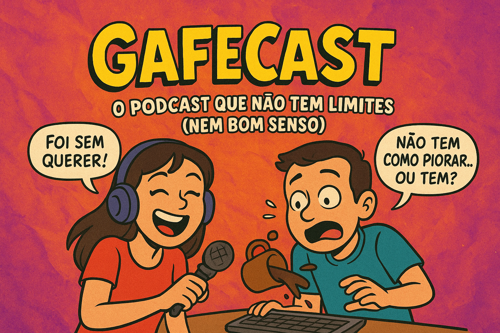

 
 

    preview do podcast

    <audio src="output/podcast ‐ audio.MP3" controls title="Podcast GafeCast"></audio>

# Projeto Podcast Gerado por I.A.s

 > ℹ️ **NOTE:** Este é o repositório desenvolvido durante uma live no Youtube em parceria com a [DIO](https://dio.me)

Projeto com o objetivo de gerar um podcast utilizando ferramentas de IA através de prompts mais trabalhado.

Utilizer uma esteira de prompts para gerar cada etapa do processo criativo.

## 💻 Tecnologias utilizadas no projeto

- [ChatGPT](https://chat.openai.com/) 
- [Copilot](https://copilot.microsoft.com/)
- [Clipchamp](https://app.clipchamp.com/)
- [Uppbeats](https://uppbeat.io/)

## ✨ Como foi feito ?

- Roteiro gerado via chatgpt/copilot
- Chatgpt Para gerar capa
- Audio gerado pelo Clipchamp
- Efeitos de som pelo Clipchamp/Uppbeats

## 📚 Materiais

- [Link da live no Youtube](https://www.youtube.com)
- [Notion Template](https://helpful-jump-17b.notion.site/PAS-Podcast-AI-Studio-210489e15d7a4a73b743bb159e45d06f?pvs=4)
- [Editor de aúdio](https://www.capcut.com/editor?from_page=landing_page&__action_from=picture_V%C3%ADdeos%20profissionais%20em%20minutos,%20n%C3%A3o%20em%20horas.)

## 🛠️ Instruções de execução

Utilize os prompts dentro do link do `Notion` fornecido na parte de `Materiais` para criar um podcast de maneira automatizada, para isso siga o passo a passo abaixo.

- 🤖 1. Use os prompts de roteiro no `chagpt`
- 🤖 2. Use os prompts de roteiro gerados pelo chatgpt no  `ElevenLabs`
- 🤖 3. Use os prompts de artes no `midjourney`

## 📦 Novidades

- Tema do Podcast leve, engraçado e cheio de situações cotidianas é o tipo de conteúdo que conquista pela identificação.
- Dois apresentadores (Dana e Dinho).
- Adição de Efeitos sonoros.
- Output .mp3 e .mp4.
- Versão .mp4 com legenda.

## 👨‍💻 Expert

    
    
&nbsp&nbsp&nbspStenio Dias Rapchan 
    &nbsp&nbsp&nbsp
    <a 
        href="https://github.com/steniodr">
        GitHub
    </a>
    &nbsp;|&nbsp;
    <a 
        href="https://www.linkedin.com/in/stenio-dias-rapchan/">
        LinkedIn
    </a>

  

---

⌨️ criado originalmente por [Felipe Aguiar](https://github.com/felipeAguiarCode)